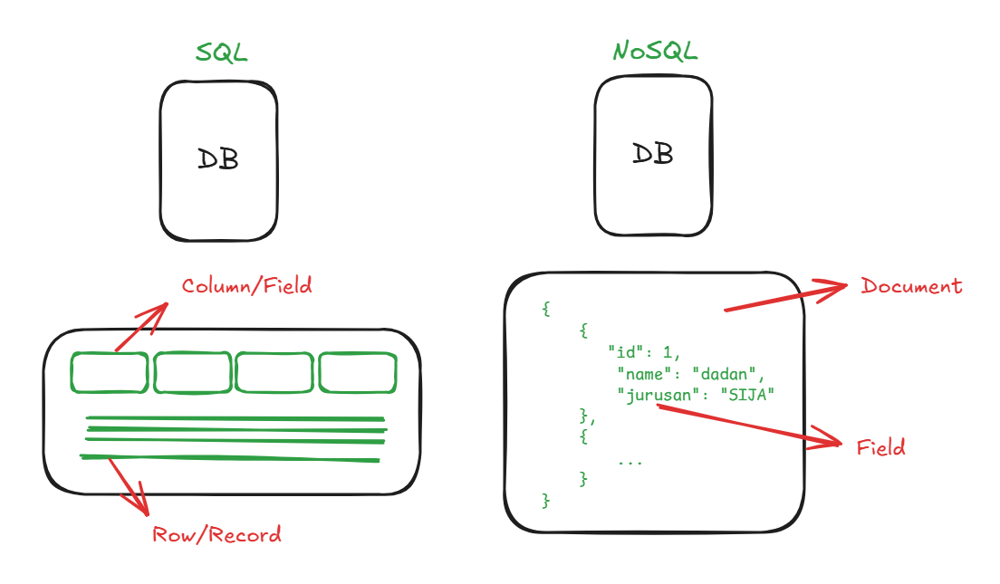
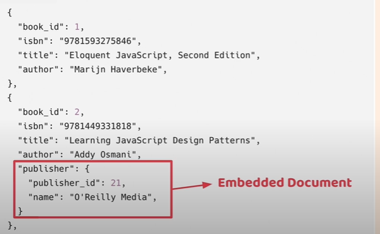

# MongoDB (Humongous Database)

MongoDB adalah sebuah **database berbasis dokumen** yang memiliki skalabilitas dan fleksibilitas yang kita inginkan dan juga memiliki fitur query dan indexing yang kita butuhkan.

## NoSQl Database
- "**N**ot **O**nly" SQL
- Schemaless / Flexible Schema
- Denormazilation
- Non-relational Database
- Unstructured, semi-structured, structured data

## Tipe NoSQL Database
- Key-value store
  - redis
- Document Based
  - MongoDB, CouchDB
- Column-oriented Database
  - HBase, Cassandra
- Graph Database
  - Neo4j

## Terminologi pada SQL vs NoSQL

## Konsep Embedded Document (Denormalization)

Intinya tidak baku, tidak harus buat column dulu kalau mau menambahkan data baru.

## Kenapa MongoDB?
- JSON (BSON = Binary JSON)
- Javascript
- MERN, MEVN, MEAN